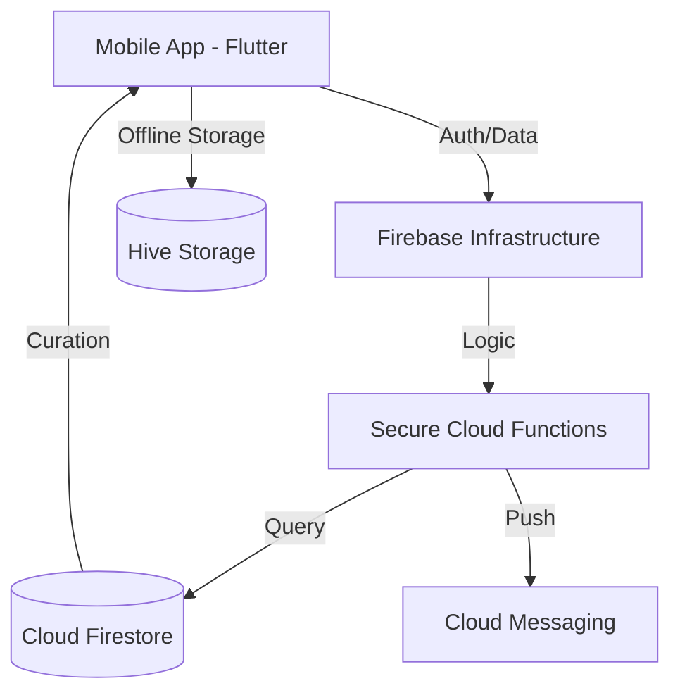

# InspiraVerse 🌌
**Architecting the Daily Evolution of the Modern Mind.**

InspiraVerse is a premium, flagship-grade mindfulness application designed for high-performance individuals who seek daily psychological curation. Built on the "Aura" design system, it delivers masterpiece-grade aesthetics, glassmorphism effects, and unshakeable data sovereignty.

## 🚦 Production Status
- **Google Play Submission**: Attempt #18
- **Current Version**: `1.0.0+18`
- **Audit Status**: 🛡️ **Verified Stable** (Full Compliance Audit Completed)
- **APK Artifact**: [InspiraVerse-V18-Final.apk](file:///E:/Download/InspiraVerse-V18-Final.apk)

---

## 💎 Product Strategy

### The Vision
To become the world's most trusted digital sanctuary for psychological evolution, leveraging elite curation and data sovereignty to combat the global mental fatigue epidemic.

### Market Opportunity
The global mental wellness market is projected to reach $500B+ by 2030. InspiraVerse targets the high-performance segment—individuals who prioritize mental resilience but are alienated by low-quality, ad-heavy "motivation" apps.
### The Problem
Traditional motivation apps are often cluttered with intrusive ads, outdated designs, and generic content that fails to resonate with high-achieving users. Most importantly, they treat user privacy as an afterthought, leading to "digital fatigue."

### The Solution: InspiraVerse
InspiraVerse delivers a curated, elite-level stream of psychological insights paired with a clinical-grade focus on data sovereignty. It’s not just a quote app; it’s a sanctuary for mental resilience.

### Competitive Advantage
- **Curation Alpha**: Unlike algorithms that favor engagement, our feed favors psychological stability, using datasets vetted for mental resilience.
- **Aura Design System**: Premium Glassmorphism and "Mirror Pulse" animations (via `flutter_animate`) that create a "Zen" state upon opening the app.
- **Privacy Sovereignty**: Local-first architecture with permanent "Right to be Forgotten" recursive deletion protocol, ensuring 100% compliance with global privacy standards (GDPR, CCPA, Google Play).

---

## 🚀 Technical Architecture

### Stack
- **Frontend**: Flutter (Latest Stable) + Dart
- **State Management**: Riverpod (Modular Architecture)
- **Backend**: Firebase (Cloud Functions, Firestore, Auth, Messaging)
- **Local Storage**: Hive (for high-speed offline access)
- **Landing Page**: Next.js 14 + TailwindCSS

### Flow Diagram


---

## 🎨 Branding System

### Logo Concept
A minimalist **Infinite Speech Bubble** with a central **Spark Icon**, symbolizing continuous wisdom and the sudden "aha!" moment of inspiration.

### Color Palette
- **Primary**: #6366F1 (Elite Indigo)
- **Secondary**: #F59E0B (Amber Glow)
- **Background**: #F9FAFB (Zen White)
- **Aura Gradient**: Indigo → Violet → Pink (representing the transition from focus to peaceful consciousness)

---

## 📈 Roadmap & Monetization

### 2026 Roadmap
- **Q2**: AI-Driven Mood Inference (Privacy-preserving on-device analysis).
- **Q3**: Elite Audio Journeys (Binaural beats for deep focus).
- **Q4**: Community Sanctuary (Curated group reflections).

### Monetization Strategy (Freemium)
- **Tier 1 (Free)**: Daily curated quote, basic streaks, standard share cards.
- **Tier 2 (Elite)**: Exclusive psychological packs, premium designer themes, ad-free focus experience, and cloud-sync history.

---

## 🛡️ Legal & Privacy Hub
We are 100% compliant with Google Play Data Safety policies.
- [Privacy Policy](file:///e:/GOOGLE%20PLAYSTORE%20PROJECT/INSPIRAVERSE/legal/privacy_policy.md)
- [Terms of Service](file:///e:/GOOGLE%20PLAYSTORE%20PROJECT/INSPIRAVERSE/legal/terms_of_service.md)
- [Data Usage Policy](file:///e:/GOOGLE%20PLAYSTORE%20PROJECT/INSPIRAVERSE/legal/data_usage_policy.md)
- [Medical Disclaimer](file:///e:/GOOGLE%20PLAYSTORE%20PROJECT/INSPIRAVERSE/legal/disclaimer.md)

---

## 🛠️ Setup & Deployment

### Mobile App
```bash
cd mobile_app
flutter pub get
flutter run
```

### Backend (Firebase Functions)
```bash
cd backend/functions
npm install
firebase deploy --only functions
```

### Landing Page
```bash
cd landing_page
npm install
npm dev
```

---

**© 2026 InspiraVerse Labs. Excellence is not an act, but a habit.**

