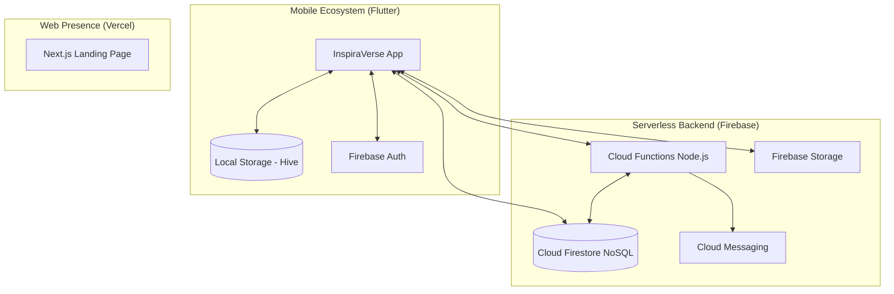
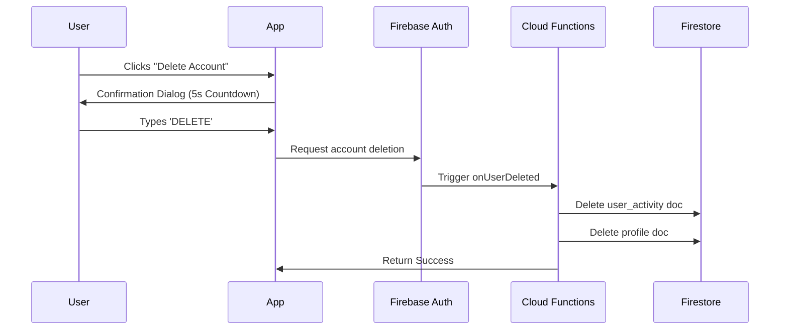
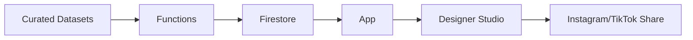

# InspiraVerse System Architecture

InspiraVerse is built on a high-resilience, serverless architecture optimized for scalability, offline performance, and compliance.

## 🏗 High-Level Architecture

## 🔐 Compliance Layer (Account Deletion)

## 📉 Content Pipeline

